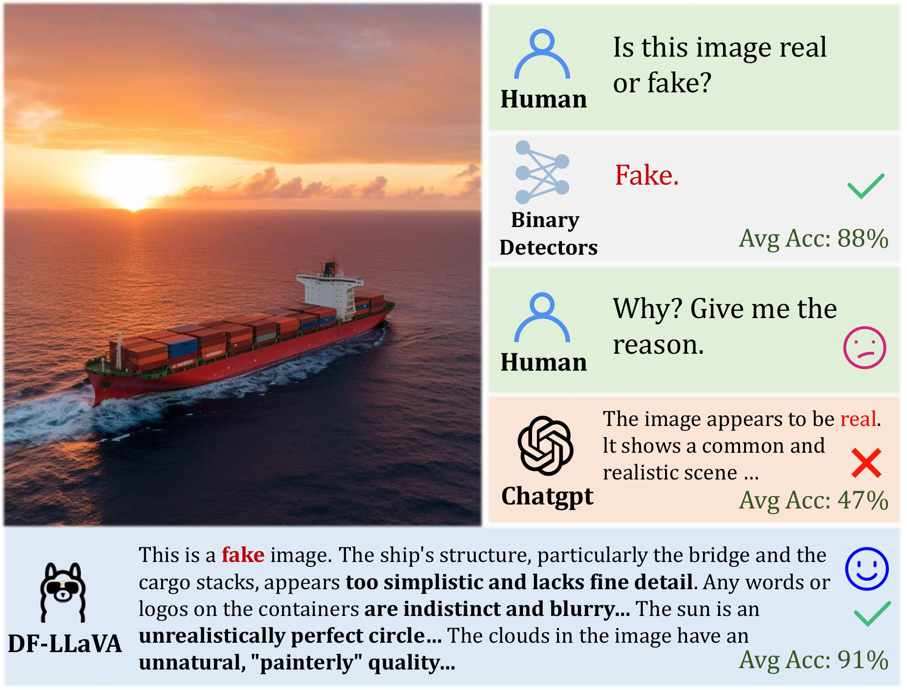
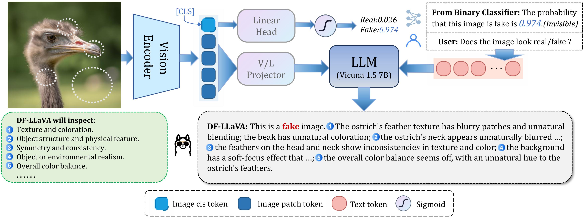

## DF-LLaVA: Unlocking MLLM's potential for Synthetic Image Detection via Prompt-Guided Knowledge Injection

### [Paper](https://arxiv.org/abs/2509.14957)

## News
- **2025.9.23** 🤗 We have released the code and classifier weights.
- **2025.9.18** 🔥 We have released **DF-LLaVA: Unlocking MLLM's potential for Synthetic Image Detection via Prompt-Guided Knowledge Injection**. Check out the [paper](https://arxiv.org/abs/2509.14957). We present DF-LLaVA model.

## Evaluate image authenticity and obtain comprehensive artifact explanations

<!-- |  | -->
|  |
|:--:|
| DF-LLaVA provides comprehensive artifact-level interpretability with detection accuracy outperforming expert models. |

|  |
|:--:|
| DF-LLaVA leverages its frozen vision encoder via a binary classifier for initial authenticity estimation, injects its probabilistic output into prompts to enhance detection accuracy, and finally explain artifacts from various perspectives. |

## Contents

- [Install](#install)
- [Models](#models)
- [Data](#data)
- [Training](#Training)


### Install

1. Clone the repo into a local folder.

```bash
git clone https://github.com/Eliot-Shen/DF-LLaVA.git

cd DF-LLaVA
```

2. Install packages.

```bash
conda create -n dfllava python=3.10 -y
conda activate dfllava
pip install --upgrade pip 
pip install -e .
pip install -e ".[train]"
pip install flash-attn --no-build-isolation
```

### Models
Pretrained model weights will be released on Hugging Face soon.

The auxiliary binary classifier weights are released [here](https://github.com/Eliot-Shen/My-UFD/tree/main/checkpoints/clip_vitl14_336-2025-08-19-13-12-24).


### Training

#### 1.Download training data
Please download the training data from [FakeClue](https://huggingface.co/datasets/lingcco/FakeClue).

#### 2.Train the auxiliary classifier
Use the code from [My-UFD](https://github.com/Eliot-Shen/My-UFD) to train the UnivFD-style auxiliary classifier, then either select the best checkpoint or directly use the provided weights.

#### 3. Augment the train set
Run inference on the entire training set using your pretrained auxiliary classifier, and add a confidence_score field to train.json from FakeClue.
For example:
```json
[
  {
    "image": "ff++/fake/Deepfakes/c23/frames/071_054/160.png",
    "label": 0,
    "cate": "deepfake",
    "width": 256,
    "height": 256,
    "conversations": [
      {
        "from": "human",
        "value": "<image>Does the image looks real/fake?"
      },
      {
        "from": "gpt",
        "value": "..."
      }
    ],
    "confidence_score": 0.9914323091506958 
  },
]
```
#### 4.Train the LLaVA
```bash
sh ./scripts/train_dfllava.sh
```
Make sure to set "data_path" to the location of your augmented train.json.

### Evaluation
Please download the test data used in the paper from [FakeClue](https://huggingface.co/datasets/lingcco/FakeClue), [LOKI](https://huggingface.co/datasets/bczhou/LOKI) and [DMImage](https://github.com/grip-unina/DMimageDetection).


## BibTeX

```
@misc{Shen_2025_DFLLaVA,
      title={DF-LLaVA: Unlocking MLLM's potential for Synthetic Image Detection via Prompt-Guided Knowledge Injection}, 
      author={Zhuokang Shen and Kaisen Zhang and Bohan Jia and Yuan Fang and Zhou Yu and Shaohui Lin},
      year={2025},
      eprint={2509.14957},
      archivePrefix={arXiv},
      primaryClass={cs.CV},
      url={https://arxiv.org/abs/2509.14957}, 
}
```

```
